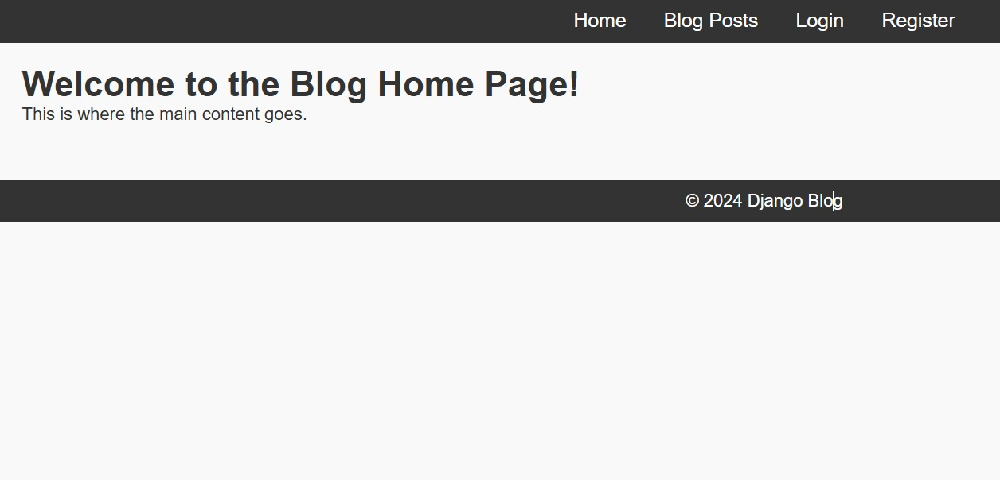

# Django Blog Application

## Overview

This is a Django-based blog application that allows users to create and manage blog posts. It features user registration, authentication, post management (CRUD operations), and comment functionality. Users can also search for posts and filter them by tags.

## Features

- **User Registration and Authentication**: Users can register, log in, log out, and manage their profiles.
- **Post Management**: 
  - Create, update, delete, and view blog posts.
  - Each post has a title, content, and tags.
- **Commenting System**: 
  - Add, update, and delete comments on blog posts.
- **Search Functionality**: Search posts by title or content.
- **Tag-based Filtering**: View posts by tags.
##Home

## Technologies Used

- **Django**: The web framework.
- **SQLite**: The default database used.
- **Django Class-Based Views (CBV)**: Utilized for efficient CRUD operations.
- **Django Templates**: For rendering HTML pages.

## Getting Started

### Prerequisites

Ensure you have the following installed:

- Python 3.x
- Django 3.x or newer
- A virtual environment tool like `venv` or `virtualenv` (optional but recommended)

### Installation

1. **Clone the repository**:
   ```bash
   git clone https://github.com/karimtz999/django-blog-app.git
   cd django-blog-app
